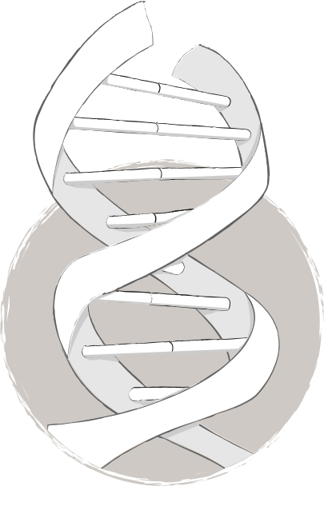

import MDXimage from '@/components/mdx/image.astro';

<figure class="bg-gray-100 col-span-12 -mx-4 lg:-mx-8">
    <MDXimage alt="Brand Guidelines for ArcticZymes" imagePath="/src/images/portfolio/arcticzymes/style-guide-full-1440.jpg" width={1280} height={720} widths={[320, 640, 960, 1280, 1440]} />
</figure>
<figure class="bg-gray-100 col-span-12 md:col-span-6">
    <MDXimage alt="ArcticZymes photography treatment" imagePath="/src/images/portfolio/arcticzymes/style-guide-photography.jpg" width={580} height={387} widths={[320, 640, 960]} />
</figure>
<figure class="bg-gray-100 col-span-12 md:col-span-6 children:w-full children:h-full children:object-cover">
    <MDXimage alt="ArcticZymes colour style guide" imagePath="/src/images/portfolio/arcticzymes/style-guide-colours.jpg" classes={["w-full", "h-full", "object-cover"]} width={580} height={387} widths={[320, 640, 960]} />
</figure>

    <h2>Vivid landscapes</h2>
    
When it came to creating the colour palette for ArcticZymes' new style guide, I drew a great deal of inspiration from the environment surrounding us. This paired particularly nicely with my passion for <a href="/portfolio/an-ode-to-the-arctic/">landscape photography</a> from around the&nbsp;region.

<figure class="bg-gray-100 col-span-12 md:col-span-6 aspect-w-3 aspect-h-4 children:w-full children:h-full children:object-cover">
    <MDXimage alt="ArcticZymes Rollup" imagePath="/src/images/portfolio/arcticzymes/az-rollup--full.jpg" classes={["w-full", "h-full", "object-cover"]} width={580} height={894} widths={[320, 640, 960]} />
</figure>
<figure class="bg-gray-100 col-span-12">
    <MDXimage alt="ArcticZymes business cards" imagePath="/src/images/portfolio/arcticzymes/az-business-cards--full.jpg" width={1200} height={502} widths={[320, 640, 960, 1200, 1440]} />
</figure> 
<figure class="bg-gray-100 col-span-12 md:col-span-6">
    <MDXimage alt="ArcticZymes website on mobile phone" imagePath="/src/images/portfolio/arcticzymes/arcticzymes-website-mobile.jpg" classes={["w-full", "h-full", "object-cover"]} width={580} height={870} widths={[320, 640, 960]} />
</figure>

    <h2>Responsive website</h2>
    
While talking with our customers, we learned that they would visit our website on their mobile device while working in the lab. With this in mind it became imperative that not only did our website function well on mobile devices, but the information for our products was quickly and easily accessible.

<figure class="bg-gray-100 col-span-12 md:col-span-6">
    <MDXimage alt="ArcticZymes website on mobile phones" imagePath="/src/images/portfolio/arcticzymes/arcticzymes-website-mobile-two.jpg" width={580} height={580} widths={[320, 640, 960]} />
</figure>
<figure class="bg-gray-100 col-span-12 md:col-span-6">
    <MDXimage alt="ArcticZymes website" imagePath="/src/images/portfolio/arcticzymes/arcticzymes-website-browser.jpg" width={580} height={580} widths={[320, 640, 960]} />
</figure>
<figure class="bg-gray-100 col-span-12 -mx-4 lg:-mx-8">
    <MDXimage alt="ArcticZymes website screens" imagePath="/src/images/portfolio/arcticzymes/arcticzymes-website.png" width={1280} height={640} widths={[320, 640, 960, 1280, 1440]} />
</figure>

    <h2>Illustrative</h2>
    
Occasionally there was a need for something a little more experimental and fun, this is science after all! Typically the illustrations needed to explain complex workflows in a simplistic manner, involving few words. This could get tricky, but working alongside the scientists we would get the results we were after.

<figure class="col-span-12 md:col-span-6 aspect-w-3 aspect-h-4 children:w-full children:h-full children:object-contain">
    
</figure>
<figure class="bg-gray-100 shadow-md col-span-12 md:col-span-4">
    <MDXimage alt="Cod UNG poster" imagePath="/src/images/portfolio/arcticzymes/cod-poster.jpg" width={373} height={527} widths={[320, 640, 960]} />
</figure>
<figure class="bg-gray-100 shadow-md col-span-12 md:col-span-4">
    <MDXimage alt="Contamination control poster" imagePath="/src/images/portfolio/arcticzymes/cc-control-poster.jpg" width={373} height={527} widths={[320, 640, 960]} />
</figure>
<figure class="bg-gray-100 shadow-md col-span-12 md:col-span-4">
    <MDXimage alt="Heat and Run poster" imagePath="/src/images/portfolio/arcticzymes/handr-poster.jpg" width={373} height={527} widths={[320, 640, 960]} />
</figure>
<figure class="bg-gray-100 col-span-12 -mx-4 lg:-mx-8">
    <MDXimage alt="ArcticZymes Powerpoints" imagePath="/src/images/portfolio/arcticzymes/powerpoint.jpg" width={1280} height={720} widths={[320, 640, 960, 1280, 1440]} />
</figure>

    <a href="/portfolio/" class="text-sm font-bold uppercase"><svg xmlns="http://www.w3.org/2000/svg" width="16" height="16" viewBox="0 0 24 24" class="inline" fill="none" stroke="currentColor" stroke-width="2" stroke-linecap="round" stroke-linejoin="round"><path d="M19 12H6M12 5l-7 7 7 7"></path></svg> <small>Back to the portfolio</small></a>

